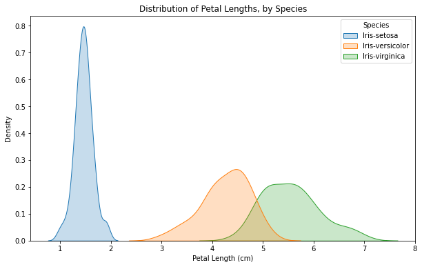
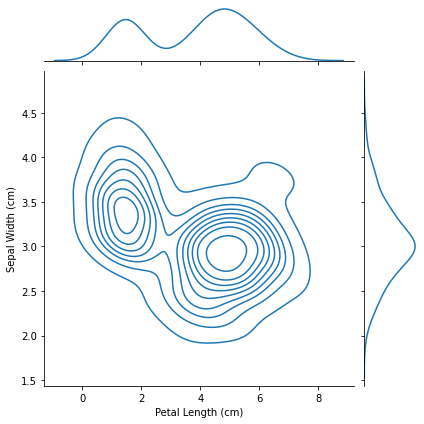
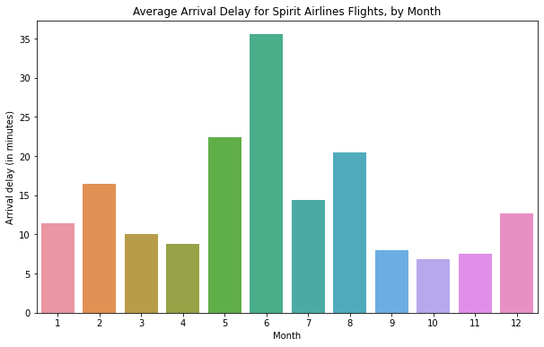
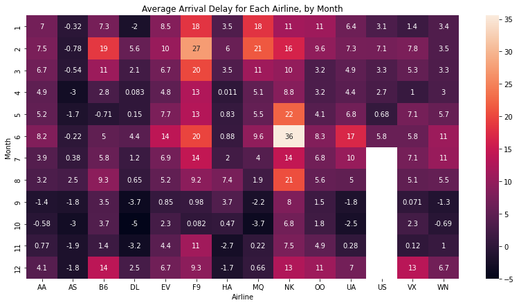
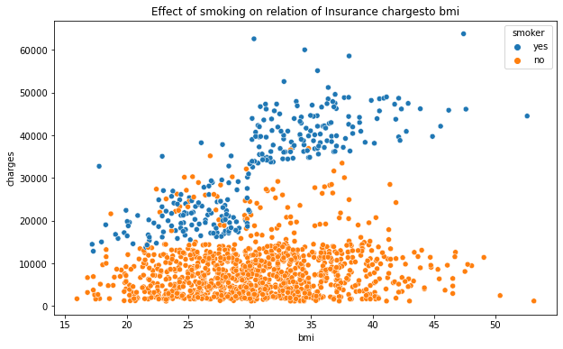
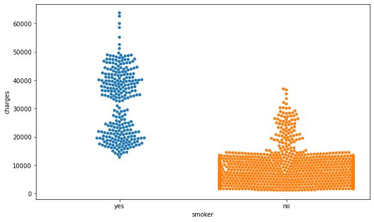
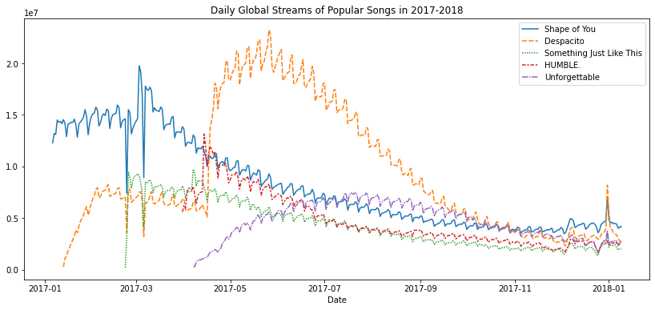

# Data Visualization Python
Below is a summary of projects on data visualization in python using seaborn. The projects features lineplot, bar charts, scatter plots, swarm plots, heat map, Density plots, KDE plots and 2KDE plots.
Please check the individual projects for more details about the dataset and code implementation.
## Iris Flower Dataset 
The dataset contains 150 different flowers, or 50 each from three different species of iris (Iris setosa, Iris versicolor, and Iris virginica).

#### Analysis
One interesting pattern that can be seen in plots is that the plants seem to belong to one of two groups, where Iris versicolor and Iris virginica seem to have similar values for petal length, while Iris setosa belongs in a category all by itself.
In fact, according to this dataset, we might even be able to classify any iris plant as Iris setosa (as opposed to Iris versicolor or Iris virginica) just by looking at the petal length: if the petal length of an iris flower is less than 2 cm, it's most likely to be Iris setosa!
In the plot below, the color-coding shows us how likely we are to see different combinations of sepal width and petal length, where darker parts of the figure are more likely.

## Flight Delays Dataset (USA)
Dataset from the US Department of Transportation that tracks flight delays.Each entry shows the average arrival delay (in minutes) for a different airline and month (all in year 2015). Negative entries denote flights that (on average) tended to arrive early. 

#### Analysis
In the case of Spirit Airlines, it appears that delays are greatest between May and August as compared to other months of the year.
From the heatmap below it appears that the months toward the end of the year (especially months 9-11) appear relatively dark for all airlines. This suggests that airlines are better (on average) at keeping schedule during these months!

## Insurance Dataset
Aim of the project is to look at a dataset of insurance charges, to see if we can understand why some customers pay more than others.

#### Anaylsis
The scatterplot above suggests that body mass index (BMI) and insurance charges are positively correlated, where customers with higher BMI typically also tend to pay more in insurance costs. (This pattern makes sense, since high BMI is typically associated with higher risk of chronic disease.)

Above plot shows that on average, non-smokers are charged less than smokers, and the customers who pay the most are smokers; whereas the customers who pay the least are non-smokers.
## Spotify Dataset
The dataset for this tutorial tracks global daily streams on the music streaming service Spotify. We focus on five popular songs from 2017 and 2018: "Shape of You", by Ed Sheeran, "Despacito", by Luis Fonzi, "Something Just Like This", by The Chainsmokers and Coldplay, "HUMBLE.", by Kendrick Lamar and"Unforgettable", by French Montana

#### Analysis
From the above graph, the songs follow a bell curve. That is the streams rapidly grows after the songs is released, reaches a peak and then gradually falls as time passes. Additionally although different songs might have different streams at the begining or the peak, they generally fall to about the same streams in the long run. 

